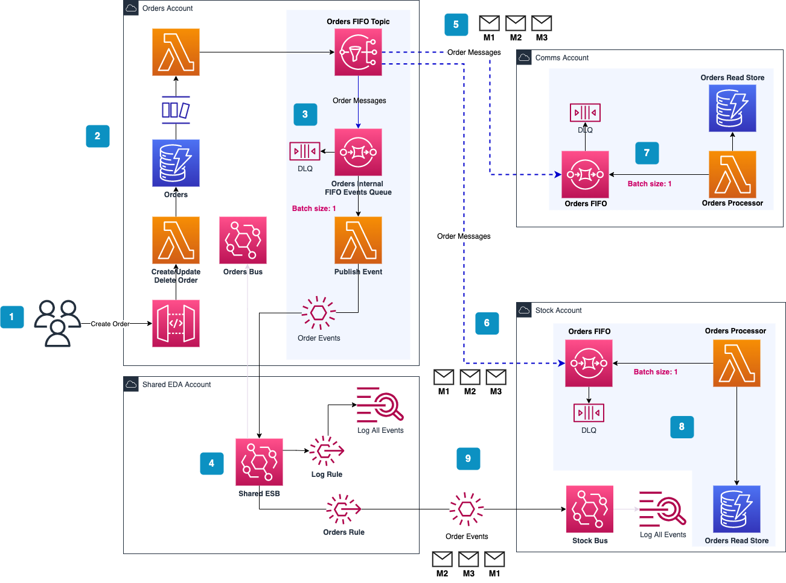

# Guaranteed event ordering when using Amazon EventBridge as your Enterprise Service Bus

Example of Serverless Event-driven Read Stores with Serverless Architecture Layers

## Introduction

Example use case of populating ordered event-driven domain read stores using the 'flexible domain events' pattern, with code examples in the AWS CDK and TypeScript

You can view the [article here](x)

> This is a minimal set of code to demonstrate the points discussed in the article, so coding and architecture best practices have not been adhered too (inc unit testing)

## Getting started

**Note: This will incur costs in your AWS account on running the load tests which you should account for.**

Please view the detailed deployment steps in the article.

## Removing the services

To remove the services run the following command in the three main stack folders: `npm run remove`

